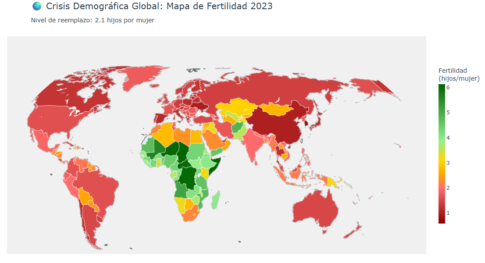
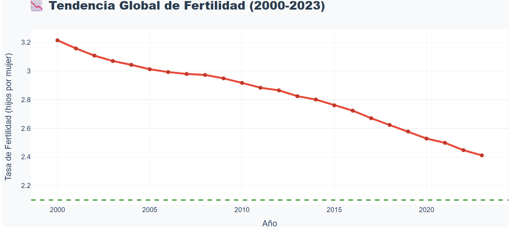
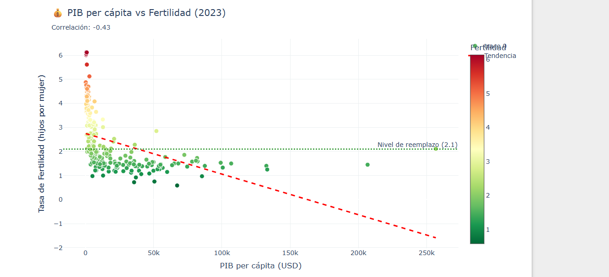

# 📊 Análisis de la Caída de Natalidad Mundial

## 🌍 Descripción del Proyecto

Este proyecto analiza la tendencia global de disminución de las tasas de natalidad, explorando qué países están experimentando este fenómeno y qué factores económicos, sociales y políticos podrían explicarlo.

**Motivación**: La caída de natalidad es uno de los fenómenos demográficos más importantes del siglo XXI, con implicaciones profundas para la economía, sistemas de pensiones, y la estructura social de las naciones.

---

## 🎯 Objetivos

1. **Mapear la tendencia global**: Identificar países con caída vs estabilidad en natalidad
2. **Análisis causal**: Explorar correlaciones con factores económicos, sociales y políticos
3. **Casos de estudio**: Analizar países outliers (contra la tendencia)
4. **Generar insights**: Crear visualizaciones y conclusiones compartibles

---

## 📁 Estructura del Proyecto

```
natalidad-mundial/
│
├── docs/                          # Documentación del proyecto
│   ├── project_brief.md          # Descripción completa del proyecto
│   ├── research_questions.md     # Preguntas de investigación
│   └── data_sources.md           # Fuentes de datos
│
├── notebooks/                     # Jupyter notebooks
│   ├── 01_data_collection.ipynb  # Recoleccion de datos
│   ├── 02_data_cleaning.ipynb    # Limpieza, procesamiento y analisis
│
├── data/
│   ├── raw/                       # Datos originales (no modificar)
│   └── processed/                 # Datos procesados
│
├── outputs/
│   ├── figures/                   # Gráficos generados
│   └── reports/                   # Reportes en PDF/HTML
│
├── requirements.txt               # Dependencias del proyecto
├── .gitignore                     # Archivos a ignorar en Git
└── README.md                      # Este archivo
```

---

## 🛠️ Tecnologías Utilizadas

- **Python 3.10+**
- **Pandas** - Manipulación de datos
- **NumPy** - Cálculos numéricos
- **Matplotlib / Seaborn** - Visualización estática
- **Plotly** - Visualización interactiva
- **GeoPandas / Folium** - Mapas
- **Jupyter** - Notebooks interactivos
- **wbgapi** - API del Banco Mundial

---

## 🚀 Cómo Empezar

### 1. Clonar el Repositorio
````bash
git clone https://github.com/JavierGuerra13/analisis-natalidad-mundial.git
cd analisis-natalidad-mundial
````

```

### 2. Crear Entorno Virtual (Recomendado)
```bash
# Windows
python -m venv venv
venv\Scripts\activate

# Mac/Linux
python3 -m venv venv
source venv/bin/activate
```

### 3. Instalar Dependencias
```bash
pip install -r requirements.txt
```

### 4. Ejecutar los Notebooks
````markdown
```bash
jupyter notebook
```

Abre `notebooks/02_data_cleaning.ipynb` para ver el análisis completo.
````


---

## 📊 Fuentes de Datos Principales

- **Banco Mundial** - World Development Indicators
- **Naciones Unidas** - Population Division
- **OECD** - Políticas familiares y económicas
- **Our World in Data** - Datos compilados

Ver [data_sources.md](docs/data_sources.md) para detalles completos.

---

## 🔍 Preguntas de Investigación

### Principales:
1. ¿La caída de natalidad es un fenómeno universal?
2. ¿Qué factores económicos están más correlacionados?
3. ¿Qué países van contra la tendencia y por qué?
4. ¿Las políticas públicas son efectivas?

Ver [research_questions.md](docs/research_questions.md) para la lista completa.

---

## 📈 Visualizaciones Destacadas

### 🌍 Mapa Mundial de Fertilidad 2023

*Visualización interactiva que muestra la crisis demográfica global, con países codificados por color según su tasa de fertilidad.*

### 📉 Tendencia Global (2000-2023)

*La fertilidad mundial cayó de 3.21 a 2.41 hijos por mujer en solo 23 años, acercándose peligrosamente al nivel de reemplazo.*

### 💰 Correlación PIB vs Fertilidad

*Correlación negativa de -0.43: a mayor riqueza, menor fertilidad. Los 5 países más ricos promedian 1.5 hijos por mujer.*

### 🇭🇺 Caso Hungría: ¿Funcionan las políticas pro-natalidad?
*Análisis del impacto de políticas gubernamentales agresivas. Resultado: ligera mejora de 1.23 a 1.32, pero insuficiente.*

### 🌍 Las DOS Áfricas
*Comparación entre África Subsahariana (4.18) y África del Norte (2.5), revelando mundos demográficos completamente diferentes.*

## 🔍 Hallazgos Clave

### 📊 Estadísticas Globales
- **52%** de países están por debajo del nivel de reemplazo (2.1)
- **Caída promedio:** -25% en fertilidad mundial desde 2000
- **Regiones en crisis:** Europa (1.40), Asia Oriental (1.25)
- **Regiones estables:** África Subsahariana (4.18)

### 💡 Insights Principales

1. **La crisis es casi universal:** Todos los continentes muestran tendencia a la baja.

2. **El dinero importa:** Correlación negativa moderada (-0.43) entre PIB y fertilidad.

3. **Las políticas tienen efecto limitado:** Hungría gastó miles de millones con resultados mínimos.

4. **Dos tipos de bajada:** En países desarrollados es por elección. En África puede ser por reducción de mortalidad infantil.

5. **Asia Oriental en crisis severa:** Corea del Sur (0.72), Japón (1.26) enfrentan colapso demográfico inminente.

---

## 📈 Estado del Proyecto

- [x] ✅ Planificación y documentación
- [x] 🔄 Recolección de datos
- [x] ⏳ Limpieza de datos
- [x] ⏳ Análisis exploratorio
- [x] ⏳ Análisis profundo
- [x] ⏳ Visualizaciones finales
- [x] ⏳ Reporte y publicación

---

## 📝 Roadmap

### Fase 1: Datos (En progreso)
- [x] Descargar datos del Banco Mundial
- [x] Descargar datos de ONU
- [x] Integrar datasets

### Fase 2: Análisis
- [x] EDA (Análisis Exploratorio)
- [x] Correlaciones y estadísticas
- [x] Identificar outliers

### Fase 3: Visualización
- [x] Mapas interactivos
- [x] Gráficos de tendencias
- [ ] Dashboard (opcional)

### Fase 4: Comunicación
- [ ] Reporte final
- [ ] Publicaciones para X/Twitter
- [ ] Actualizar GitHub

---

## 🤝 Contribuciones

Este es un proyecto personal de aprendizaje y portafolio. Sin embargo, sugerencias y feedback son bienvenidos.

---

## 📄 Licencia

Este proyecto está bajo licencia MIT. Los datos utilizados provienen de fuentes públicas y mantienen sus licencias originales.

---

## 👤 Autor

**[Javier Guerra]**
- GitHub: (https://github.com/JavierGuerra13)
- LinkedIn: (www.linkedin.com/in/javier-guerra13)


---

## 📚 Referencias

- World Bank Data: https://data.worldbank.org/
- UN Population Division: https://population.un.org/
- Our World in Data: https://ourworldindata.org/

---

**Última actualización**: Febrero 2026
